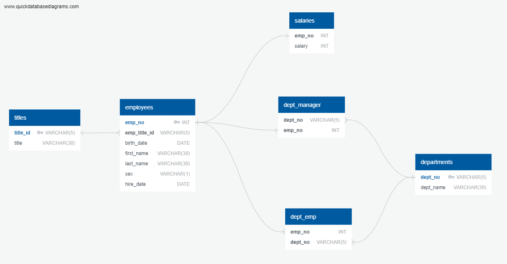

# sql-challenge

## Employee Database SQL Scripts

In this repository, you will find SQL scripts for creating and querying an employee database. These scripts are designed for managing employee-related data and performing various queries on the database.

## Source of the Code

The SQL scripts in this repository were developed for an assignment related to an employee database. The scripts include the creation of tables and several SQL queries to retrieve specific information from the database.

## Script Overview

# Data Modeling
Make an ERD with Quick Database Diagrams after inspecting the CSVs.

## Data Engineering
For each of the six CSV files, create a table schema with the necessary constraints, primary keys, foreign keys, and data types. 

### Table Creation

This section of the script includes the SQL commands to create tables for different entities in the employee database. The tables created are:

1. `titles`: Contains information about employee job titles.
2. `employees`: Stores information about employees, including their personal details and job titles.
3. `departments`: Holds data about different departments within the organization.
4. `dept_emp`: Represents the relationship between employees and their respective departments.
5. `dept_manager`: Records the managers of various departments.
6. `salaries`: Stores salary information for employees.

### Database Alteration

This section of the script includes an alteration command to set the date style for the database to "ISO, MDY". This ensures consistent date formatting.

## Data Data Analysis

The following SQL queries are included in this script to retrieve specific information from the database:

1. **List Employee Details**: This query retrieves employee numbers, first names, last names, sexes, and salaries for all employees.

2. **Employees Hired in 1986**: This query lists the first names, last names, and hire dates of employees hired in the year 1986.

3. **Department Managers**: Lists the manager of each department, including department number, department name, employee number, last name, and first name.

4. **Employees and Departments**: Lists the department number for each employee, along with their employee number, last name, first name, and department name.

5. **Hercules Employees**: Lists employees with the first name "Hercules" and whose last names begin with the letter "B," including their first names, last names, and sexes.

6. **Sales Department Employees**: Lists each employee in the Sales department, including their employee number, first name, and last name.

7. **Sales and Development Employees**: Lists employees in the Sales and Development departments, including their employee number, first name, last name, and department name.

8. **Employee Last Name Frequencies**: Lists the frequency counts of all employee last names in descending order, indicating how many employees share each last name.

## Instructions

To use these SQL scripts:

1. Execute these scripts in a SQL database management system such as MySQL or PostgreSQL.
2. The scripts will create the necessary tables and populate them with data.
3. You can then run the provided SQL queries to retrieve specific information from the database.

